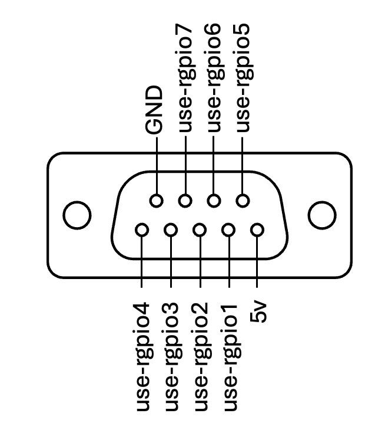

# GPIO Technical Specifications

The VZ5100, VZ6000, and VZ6100 devices have GPIO pins that can be controlled by skills. To get access to the GPIO pins, there is a privilege that needs to be enabled in the portal. An example of this can be found in the [GPIO Example Skill](../examples/optra_feature_examples/gpio). 

## Hardware Implementation
- GPIO operates at 5V TTL levels, powered by a TI TCA6408ARSVR I/O expander
- The I/O expander includes an interrupt line, enabling interrupt-driven input handling through gpiod
- Device exposes this chip as `/dev/gpiochipUSR` to skills
- GPIO signals are protected with ESD diodes

Pin Layout:

## Electrical Characteristics
- **Power Supply**: 5V supply pin provides maximum current of 1A
- **Pin Current Limits**:
  - Maximum sink current: 25 mA per pin
  - Maximum source current: 10 mA per pin
- **Input Voltage Range**: −0.5V to 6.5V relative to GND (pin 9)
  - **Warning**: Exceeding this range may damage the device

## Circuit Requirements
- No internal pull-up or pull-down resistors included
- External circuitry must supply any required biasing
- GPIO inputs are not opto-isolated
- External signals must remain within specified voltage range